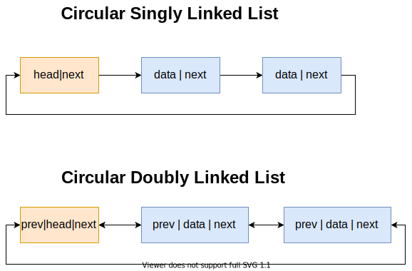

# Linked List

## Singly Linked List

The singly linked list is easy to understand. Its structure is as the picture showed below.


This structure is like a chain, and there could be many nodes in the chain. It has 3 features:

1. Each `node` has two properties: `data` and `next`. `data` stores the value and `next` points to the next node.

2. Each list must have a `head` node, it's the start of the chain.

3. The last node's `next` points to value `NULL`.

According to the features, we can write some sample code on it.

```js
// Class defination of the singly linked list node.
class SinglyLinkedListNode {
  constructor(data) {
    this.data = data;
    this.next = null;
  }
}
// Creat the head node.
var head = new SinglyLinkedListNode(null, null);

// Create a node with data = 1
var node1 = new SinglyLinkedListNode(1, null);

// Link head and node1
head.next = node1;
```

Obviously, if we only have the class of the node, it's not convenient to use.

Next, we can make a class of the list, and this class supports some functions like:

1. `append`: Add a new node to the list.
2. `remove`: Remove a node which value equals the given value.
3. `length`: Return the length of the list.

Eample code is here:

```js
class SinglyLinkedList {
  constructor() {
    this.head = null;
    this.size = 0;
  }
  get length() {
    return this.size;
  }
  append(data) {
    const node = new SinglyLinkedListNode(data, null);
    // List is empty
    if (this.head === null) {
      this.head = node;
    }
    // List is not empty, append the new node to the last node.
    // Time complexity is O(n)
    else {
      let current = this.head;
      while (current.next !== null) {
        current = current.next;
      }
      current.next = node;
      this.size += 1;
    }
  }
  remove(data) {

    let current = this.head;
    // Record previous node.
    let prev = null;

    // List has only one node,
    // and happen to remove it.
    if (current.data === data) {
      this.head = null;
      this.size = 0;
      return;
    }

    while (current.next !== null) {
      // Check if is the target node
      if (current.data === data) {
        prev.next = current.next;
        this.size -= 1;
        break;
      }
      // Move to the next
      else {
        prev = current;
        current = current.next;
      }
    }

  }
}
```

## Doubly Linked List

This type of linked list only has a little difference with `SinglyLinkedList` which is each `node` has one more property : `prev` points to the previous `node`.


The code won't be showed here, hope readers can try to implement it.

## Circular Linked List

Let's take a look at the structures of circular linked lists.



As we can see, there're two types of circular linked lists: 

1. Circular singly linked list.
2. Circular doubly linked list.

## A question from leetcode

Merge two ascending singly linked list, and the new linked list must contain all nodes in the two linked list.

```
Input : 1->2->4 , 3->4->8
Output: 1->2->3->4->4->8
```

One example answer:

```js
const list1 = new SinglyLinkedList();
list1.append(1);
list1.append(2);
list1.append(4);

const list2 = new SinglyLinkedList();
list2.append(3);
list2.append(4);
list2.append(6);
list2.append(8);

const mergedList = new SinglyLinkedList();
let pointer1 = list1.head;
let pointer2 = list2.head;

while (true) {
  // Both linked lists reach the end.
  if (pointer1 === null && pointer2 === null) {
    break;
  }

  // One list reaches the end
  if (pointer1 === null && pointer2 !== null) {
    mergedList.append(pointer2.data);
    pointer2 = pointer2.next;
    continue;
  }
  if (pointer2 === null && pointer1 !== null) {
    mergedList.append(pointer1.data);
    pointer1 = pointer1.next;
    continue;
  }

  // Compare the value, append smaller value first.
  if (pointer2.data > pointer1.data) {
    mergedList.append(pointer1.data);
    pointer1 = pointer1.next;
  } else {
    mergedList.append(pointer2.data);
    pointer2 = pointer2.next;
  }
}
```