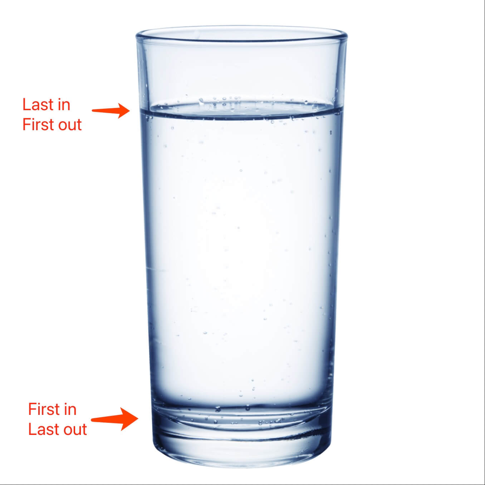
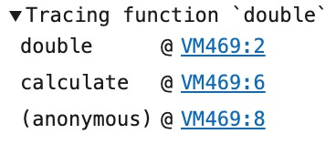
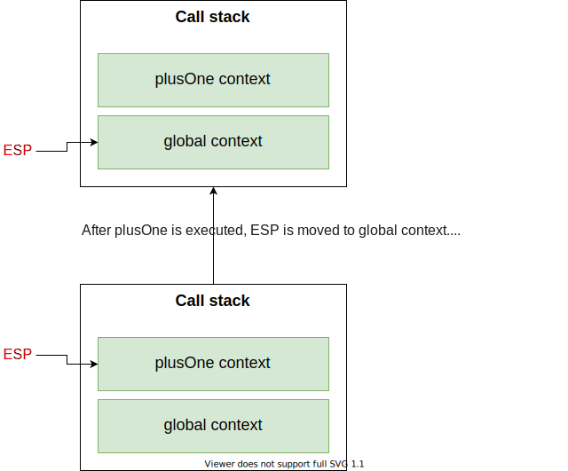
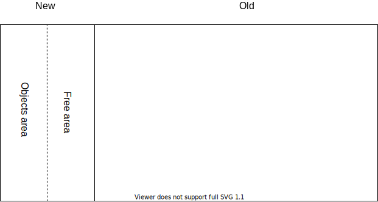

# Stack in front end

## A brief introduction of `stack`

This data structure is like a cup, if we pouring some water into the cup, the last water to be poured is the first to be drunk.  

In another word, this structure reverses the origin order: first in last out.

The picture below shows how the mechanism works. 



Here is the example implementation of `stack`: 

```js
class Stack {
  constructor() {
    this.elements = [];
  }
  get length() {
    return this.elements.length;
  }
  push(element) {
    this.elements.push(element);
    return this;
  }
  pop() {
    return this.elements.pop();
  }
  isEmpty() {
    return this.elements.length === 0 ? true : false;
  }
  getTop() {
    if (this.isEmpty()) {
      return null;
    }
    return this.elements[this.elements.length - 1];
  }
}
```

The key actions are `push` and `pop`:
* push : Put an element into stack.
* pop : Take an element out of the stack.

Now we can know if there are n elements in a stack, the searching time complexity is `O(n)`.

`push` and `pop`'s time complexity is `O(1)`.

## How `stack` works when a browser's running JavaScript

A browser runs JavaScript with single thread.

Why?

Because of `DOM`'s operations. Let's assume that there're multiple threads can operate `DOM` at the same time, we've got two solutions:

1. Single thread.
2. A `DOM` lock.

And JavaScript used the first solution. But this solution has got one problem: if some task needs a lot of time to excute, other tasks had to be wait in line. This may cause page stucked which is not a good experience for users.

To solve this problem, JavaScript has two excution modes:

**Sync**

```js
let a = 1;

if ( a > 0){
  console.log("This is a sync task");
}
```

**Async**

```js
// async task
setTimeout(()=>{
  console.log('Print later');
},100);

console.log('Print first'); // sync task
```

## Call Stack

A `call stack` is used to manage the order of function calls.

It records the position of the program is at.

```js
var a = 1;

// function defination
function plusOne(b){
  var c = 0;
  return a + b + c;
}

// function call
plusOne(2);
```

When JavaScript starts to run, the global context is like `main` in `C`.

The call stack working flow:


The right column shows how the call stack changes.

We can use `console.trace` to trace a function call stacks:

```js
function double(n){
  console.trace("Tracing function `double`");
  return n * 2;
}
function calculate(n){
  return double(n) + 1;
}
calculate(1);
```
The code will print:



We can find `double` is on the top, then `calculate`, and `anonymous` means `calculate` is called in the global context.

The numbers `2,4,6` show the line numbers of the code that each context starts at.


## Types of memory in JavaScript

The space types in memory can be classsified into 3 types:

1. Code space: store the executable code.
2. Stack space: store the call stacks and data of basic type.
3. Heap space: store data of reference type.


There are two data types based on the way of visiting the value:

1. Basic type: visit by value.
2. Reference type : visit by memory address.

**Basic types are:**

* `undefined`
* `null`
* `boolean`
* `number`
* `string`
* `bigint`
* `symbol`

**Reference types are:**

* `object`
* `array`

Basic types are stored in `stack`, reference types are stored in `heap`.

```js
var a = 1; // basic type
var b = a; // copy value of a to b
a = 2; // change value of a
console.log(b); // b is still 1  

var o1 = {age:1}; // reference type
var o2 = o1; // copy the memory address of o1 to o2
o1.age = 2; // change o1's data
console.log(o2); // o2.age is 2, because o1 and o2 points to the same address in memory.
```

## Garbage recycling

Garbage memory is recycled automatically in JavaScript. So many developers don't know the its mechanism.

### Recycle stack space

The main process uses an ESP pointer, it points to the executing context. When current function is executed, ESP moves down.



### Recylce heap space

Heap space is divided into two areas: 

* `New generation space`: stores short living objects, supporting capacity is 1-8M.
* `Old generation space`: stores long living objects or large objects, supporting capcacity has no limit.

And differient collectors are used for the two areas, sub-collector is used for `new` area, and main collector is used for `old` area.

But the collectors have the same working flow:

1. Mark: mark active objects(is being using) and unactive objects(can be recycled).
2. Garbage cleaning: recycling the space of unactive objects.
3. Memory consolidation: after recycling a lot of space, there might be many memory fragments. When the program needs a large continue memory space, there could be lack of memory.

The main and sub collector use different strategies and algorithms.

**Sub collector**

It uses Scavenge algorithm and object promotion strategy for recycling.

Scavenge algorithm splits the `new generation space` into two areas: objects area and free area. The following picture shows the structure of memory space in v8.



All the new objects are added to the `objects area`, when this area is full, gabage recyling starts to run, its working flow is:

1. Mark: mark active and unactive objects.
2. Gabage cleaning: copy all the active objects from `objects area` to `free area`, and then reverse the two areas, so `free areas` becomes `objects area` and former `objects area` becomes `free area`.
3. Object promotion: if some active objects are still active after gabage cleaning twice.

**Main collector**

`Old generation space` includes active objects from `new generation space` and large objects.

So Scavenge algorithm is not suitale here. `Mark clearance` algorithm is used here. Its flow has 3 steps:

1. Mark: traverse whole call stack, mark the objects which are referenced as `active`, mark the objects which are not referenced as `gabage`.
2. Gabage cleaning: clean all the gabage data.
3. Finishing memory: collect all the active objects together.

**Incremental mark**

V8 Engine executes the gabage collection automatically, but as we know, the JavaScript code also runs on the main process, so when gabage collection is executing, the JavaScript must stop.

To not disturb the users' experience, V8 splits gabage collections into many small tasks, these small tasks and JavaScript will be executed in turn.

## Summary

1. Stack: a Last-In-First-Out ordered set.
2. JavaScript running mechanism: 
   * Single thread.
   * Event loop.
   * Call stack.
3. Memory spaces: 
   * Code space: store executable code.
   * Stack space: store basic type data and pointers.
   * Heap space: store referenced type data.
4. Gabage recycling:
   * Recycle stack: move ESP pointer in the context stack.
   * Recycle heap: sub collector for `new generation space`, main collector for `old generation space`.


## Exercise

Design a stack which support `push`, `pop`, `top`, `getMin`. And `getMin`'s time complexity must be O(1).

All elements are numbers.