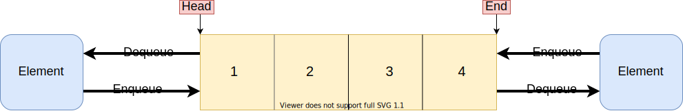

# Queue

## One-way queue

Queue's structure is simple, check out the picture below:


And the implementation is simple too.

This version of implementation supports 6 actions: `enqueue` `dequeue` `isEmpty` `front` `end` `clear` and one property `size`.

```js
class Queue {
  constructor() {
    this.elements = [];
  }
  get size() {
    return this.elements.length;
  }
  enqueue(el) {
    this.elements.push(el);
  }
  dequeue() {
    return this.elements.shift();
  }
  isEmpty() {
    return this.elements.length === 0 ? true : false;
  }
  front() {
    return this.elements[0];
  }
  end() {
    return this.elements[this.size - 1];
  }
  clear() {
    return this.elements = [];
  }
}
```

Searching's time complexity is O(n), `enqueue` and `dequeue`'s time complexity are O(1).

## Deque

A deque can enqueue or dequeue from both sides.



An example implementation is here:

```js
class Dequeue {
  constructor() {
    this.elements = [];
  }
  get size() {
    return this.elements.length;
  }
  addFront(el) {
    this.elements.unshift(el);
  }
  removeFront() {
    return this.elements.shift(el);
  }
  addEnd(el) {
    this.elements.push(el);
  }
  removeEnd() {
    return this.elements.pop();
  }
  clear() {
    this.elements = [];
  }
  front() {
    return this.elements[0];
  }
  end() {
    return this.elements[this.size - 1];
  }
}
```

## Exercises

### Reverse the words in a string. And the result must have correct blanks.

Sample 1:

```
Input: "  hello world!  "
Output: "world! hello"
```

Sample 2:

```
Input: "a good   example"
Output: "example good a"
```

An example of implementation: 

```js
function reverseWords(str) {
  const q = new Dequeue();

  let left = 0;
  let right = str.length - 1;

  // Step1 : Remove blanks on both ends.
  while (str.charAt(left) === ' ') left++;
  while (str.charAt(right) === ' ') right--;

  // Step2: Compose a word by moving `left` and `right` pointers,
  // when it is composed, add it to the front of a dequeue.
  let word = '';
  while (left <= right) {
    let char = str.charAt(left);
    if (char !== ' ') {
      word += char;
    } else if (char === ' ' && word !== '') {
      q.addFront(word);
      word = '';
    }
    left++;
  }
  // Step 3 : Convert the dequeue's elements to a string.
  return q.elements.join(' ');
}
```

### Find the longest sub-string without repeated chars of a string.

Sample 1

```
Input: "abcabcbb"
Output: "abc"
```

Sample 2

```
Input: "pwwkew"
Output: "wke"
```

Example answer using a dequeue as a window.

```js
function maxNoneRepeatSubstring(str) {
  let win = new Dequeue();
  let max = 0;

  let left = 0;
  let right = 0;

  while (left < str.length) {
    let char = str.charAt(right);
    // Find the char in current queue,
    // or reached the right end.
    if (win.elements.indexOf(char) >= 0 || right === str.length - 1) {
      left++;
      right = left;
      max = win.size > max ? win.size : max;
      win.clear();
    }
    // Can't find repeated char
    else if (char) {
      win.addEnd(char);
      right++;
    }
  }
  return max;
}
```

### Find the max number with a given array and the window which length is `k`.

```
Input: nums = [1,3,5,2,6,4,5] and k = 3.
Output: [5,6,6,6]
```

Here's an example answer without using dqueue:

```js
function findMaxNumbersInWindow(nums, k) {
  const result = [];
  let start = 0;
  while (start + k < nums.length) {
    let currentMax = 0;
    // Check each number in the window
    for (let i = 0; i < k; i++) {
      let num = nums[start + i];
      if (num > currentMax) {
        currentMax = num;
      }
    }
    result.push(currentMax);
    start++;
  }
  return result;
}
```


