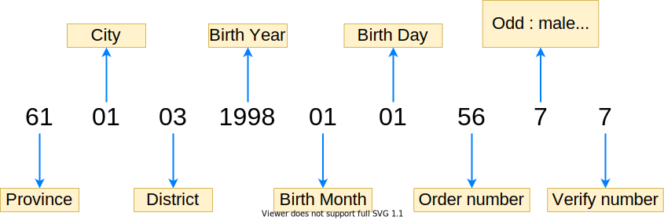
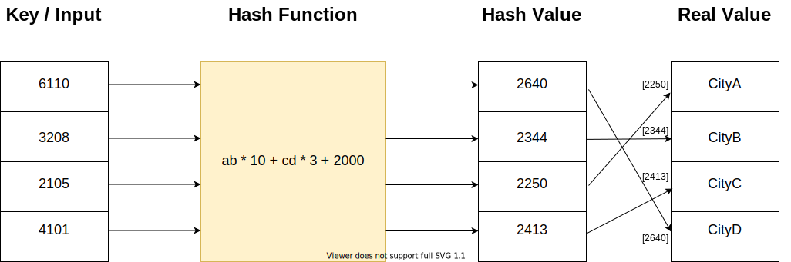
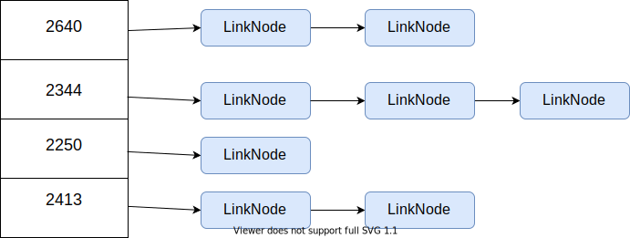

# HashTable introductions

## HashTable

It's easy to find this structure around us, like the ID card's number is a kind of hash table:



Different digit indicates different message. We have to convert the whole string of numbers to its real meanings.

Like if `61` shows in position of province, it means `ShaanXi Province`, and in this case the city's number `01` means `Xi'an`.

But when province's number is `11`, city's number `01` means `Beijing`. The 8-digit birth's number has no relations with other numbers.

This example tells us sometimes there is a relationship between them, yet sometimes there isn't.

The way of conversion is called `hash function` in computer science.



This picture shows the process of the hash table.


## Hash function

A hash function can convert the `key` to a `hash value` that represents the address of the real value.

And it has 3 requirements:

1. A hash value can't be a negative number.
2. Same key, same hash value.
3. Different key, the key may be the same.

Let's use the 6-digit city's number as an example:

If each key has a unique hash value, that means 6-digit number must have 1 million hash values to store.

Of course this solution can solve the problem, but it will waste a lot of space. And search's time complexity is O(n).

Is there any other better solutions?

Yes! One of the solutions is we imagine each `hash value` as a linked list.

So each `hash value` is the address of a linked list!




Here is another problem sometims the keys are different, but the `hash value` is the same, how to solve this confict?


## Conflict resolution


## Implementation

Here is a sample implementation of the 6-digit city's hash table.

```js
class HashLinkedNode {
  value: any;
  key: string;
  next: HashLinkedNode | null;

  constructor(key: string, value: any) {
    this.key = key;
    this.value = value;
    this.next = null;
  }
}

class HashTableForCityNumber {

  buckets: HashLinkedNode[];

  private bucketSize: number = 1000;

  constructor() {
    this.buckets = [];
  }

  // Treat the number as a 6-digit int.
  private hash(key: number): number {
    let bucketNum = Math.floor(key / this.bucketSize);
    return bucketNum;
  }

  // Loop the link list to find the node.
  private findNodeByKeyInBucket(head: HashLinkedNode, key: string): any {
    let current = head;
    let prev = null;
    let node: HashLinkedNode = null;

    while (current !== null) {
      if (current.key === key) {
        node = current;
        break;
      }
      prev = current;
      current = current.next;
    }
    return {
      current: node,
      prev: prev
    };
  }

  put(key: string, value: any): void {
    const bucketNum: number = this.hash(parseInt(key));
    const bucketHead: HashLinkedNode = this.buckets[bucketNum];

    // First node
    if (typeof bucketHead === 'undefined') {
      this.buckets[bucketNum] = new HashLinkedNode(key, value);
    }
    else {
      const targetNode = this.findNodeByKeyInBucket(bucketHead, key);
      // Insert the new node to head
      if (targetNode.current === null) {
        const insertNode = new HashLinkedNode(key, value);
        insertNode.next = bucketHead;
        this.buckets[bucketNum] = insertNode;
      }
      // Replace current value
      else {
        targetNode.current.value = value;
      }
    }
  }
  get(key: string): HashLinkedNode {
    const bucketNum: number = this.hash(parseInt(key));
    const bucketHead: HashLinkedNode = this.buckets[bucketNum];
    const targetNode = this.findNodeByKeyInBucket(bucketHead, key).current;
    return targetNode ? targetNode.value : null;
  }
  remove(key: string): HashLinkedNode {
    const bucketNum: number = this.hash(parseInt(key));
    const bucketHead: HashLinkedNode = this.buckets[bucketNum];
    const targetNode = this.findNodeByKeyInBucket(bucketHead, key);

    if (targetNode.current === null) {
      throw new TypeError(`Can't remove a node which doesn't exist.`);
    }
    // Remove the head
    else if (targetNode.prev === null) {
      this.buckets[bucketNum] = targetNode.current.next;
    }
    // Remove node in the middle
    else {
      targetNode.prev.next = targetNode.current.next;
    }
    return targetNode.current;
  }
}

const cityHashTable = new HashTableForCityNumber();
cityHashTable.put('110011', 'hello');
cityHashTable.put('123116', 'world');
console.log(cityHashTable.get('110011'));
cityHashTable.remove('123116');
cityHashTable.put('110011', 'hello2');
console.log(cityHashTable.get('110011'));
```


